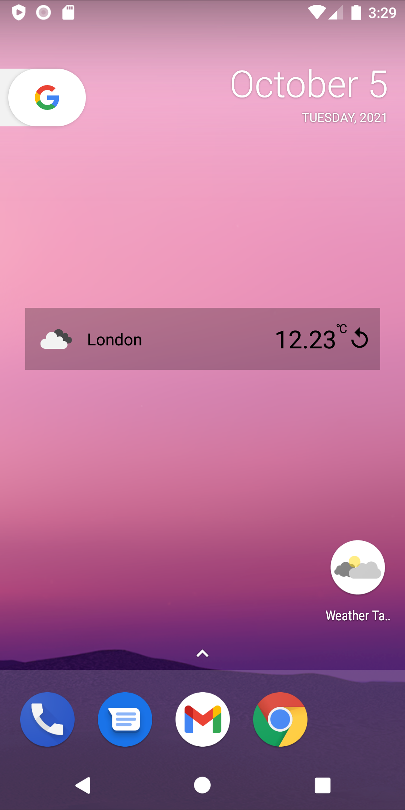
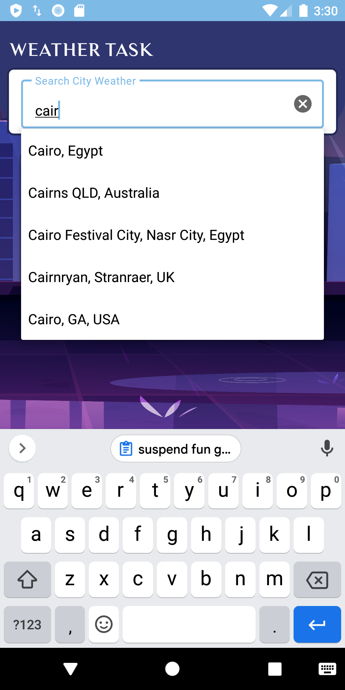
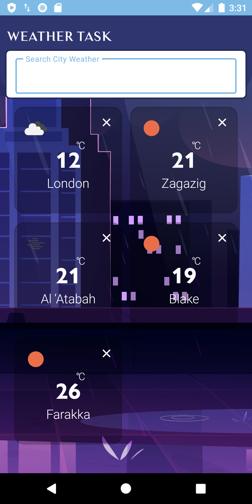
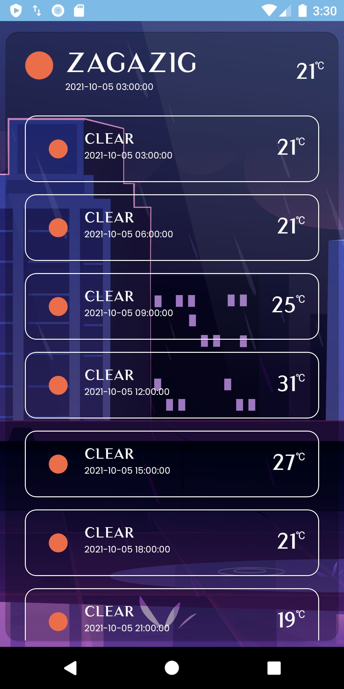
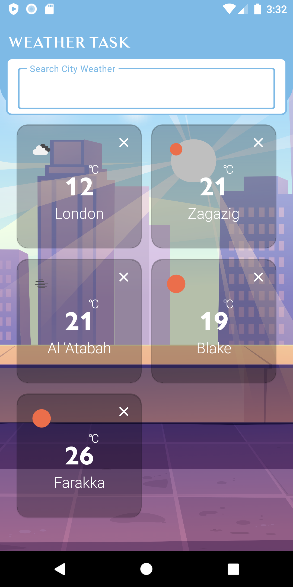
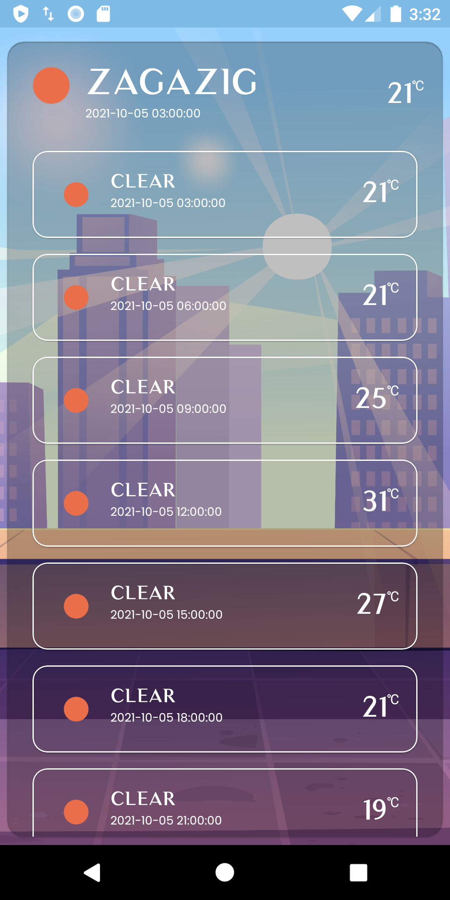

# Code95 Android Task - Weather app

## Requirements
Create a simple mobile application that:
*   Utilize a weather API (http://openweathermap.org/API for example) to search for a city and get the forecast..
*   You can add up to 5 cities to the main activity. You can also remove cities from the main activity.
*   When clicking on one of the cities from the main activity, a 5 days forecast should be displayed.
*   When clicking on one of the cities from the search box dropdown, a 5 days forecast should be displayed, while having the ability to include it in the main activity if it's not already included. 
*   The main activity will have the 1st city added by default, which will be based on the GPS location. If the user doesn't give the location permissions, then the first default city will be London, UK.
*   Save the data for offline usage.
*   Extra bonus for creating a widget.

## Features
- `Google Places`, using google places to find city and get lat and long
- `Weather Widget`, display room data of city
- `Chuck Logging`, Chuck is a simple in-app HTTP inspector for Android OkHttp clients, https://github.com/jgilfelt/chuck `com.readystatesoftware.chuck:library:1.1.0` check integration file  \weathertask\di\modules\NetworkModule , Method name is `provideOkHttpClient` , **Be Careful this lib must be in Debug mode only**

## API Key
API keys is very secure data we can not publish it
- `Google Places`, you can change google places key from \gradle.properties
- `Open Weathermap`,  you can change Open Weathermap key from \gradle.properties

 ###### **Tecgnologes uses in it.**
 * Kotlin.
 * xml
 * Navigation components 
 * MVVM Design Pattern
 * Hilt
 * Room DataBase
 * LiveData
 * Coroutines
 * Retrofit
 * Google Places
 * widget
 
  ###### **Tools and IDEs uses.**
* Android Studio
* photoshop
* Postman
* Adobe XD

*   **[Download latest debug APK here] (https://github.com/alfayedoficial/Code95_Weather_Task/blob/master/debug/app-debug.apk)**.

| Weather Widget | Google places search |
| --------------- | ---------------- | 
|  |  |

| Screen Night 1 | Screen Night 2 |
| ---------------- | ---------------- |
|   |   |

|  Screen Morning 1  | Screen Morning 2 | 
| ------------ | ------------ | 
|  |   |

## License
Copyright (c) Open Knowledge Lab Karlsruhe
All rights reserved.

Redistribution and use in source and binary forms, with or without
modification, are permitted provided that the following conditions are met:

1. Redistributions of source code must retain the above copyright notice, this
  list of conditions and the following disclaimer.

2. Redistributions in binary form must reproduce the above copyright notice,
  this list of conditions and the following disclaimer in the documentation
  and/or other materials provided with the distribution.

THIS SOFTWARE IS PROVIDED BY THE COPYRIGHT HOLDERS AND CONTRIBUTORS "AS IS"
AND ANY EXPRESS OR IMPLIED WARRANTIES, INCLUDING, BUT NOT LIMITED TO, THE
IMPLIED WARRANTIES OF MERCHANTABILITY AND FITNESS FOR A PARTICULAR PURPOSE ARE
DISCLAIMED. IN NO EVENT SHALL THE COPYRIGHT HOLDER OR CONTRIBUTORS BE LIABLE
FOR ANY DIRECT, INDIRECT, INCIDENTAL, SPECIAL, EXEMPLARY, OR CONSEQUENTIAL
DAMAGES (INCLUDING, BUT NOT LIMITED TO, PROCUREMENT OF SUBSTITUTE GOODS OR
SERVICES; LOSS OF USE, DATA, OR PROFITS; OR BUSINESS INTERRUPTION) HOWEVER
CAUSED AND ON ANY THEORY OF LIABILITY, WHETHER IN CONTRACT, STRICT LIABILITY,
OR TORT (INCLUDING NEGLIGENCE OR OTHERWISE) ARISING IN ANY WAY OUT OF THE USE
OF THIS SOFTWARE, EVEN IF ADVISED OF THE POSSIBILITY OF SUCH DAMAGE.
<!-- Pixel 3 XL API 30 -->
